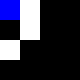

# REINFORCEMENT LEARNING : MAZE PROBLEM

In machine learning, there are three methods for training a model to perform a task. This include **supervised learning**, **unsupervised Learning** and **reinforcement learning**. The supervised learning involves training a model on labeled data while unsupervised learning relises on unlabeled data and the objective consiste of extracting patterns, structures, or relationships that exits within the training data. The reinforcement learning is an approch that consist of training and agent to execute and action which consist of multiple step by rewarding at each step the desired actions that enables acheiving the goal in a fastest way a or in opposite punishing undesired actions that does not enable acheiving the goal.

One of the best example of problem that reinforcement learning approach is suitable for is the so call `maze problem`. The simple version of maze problem consists of finding the shortest path to exit a 2D maze. The problem can be complexified by requiring to first find the shortest path a potential treasor hidden somewhere in the maze before to find the shortest path to exit.  In this repository, will apply reinforment learning to solve both maze use case problem.

## General background 
In reinforcement learning, the problem is state the following way. An `agent` (in this case the person finding the shortest path to exit) takes `action` (in this case chose the next cell to move to) in the `environement` (in this case the maze) multiple times until it acheives the final goal (which in this case is to exit the maze). To take an `action`, the agent observes the current `state` of the environement and applies a decision process call `policy`. Once the action is taken, the agent recives a `reward` and the `state` of the environment is modified. The process is repeated until the goal is acheived. This process of training based on `policy` and `reward` enables the `agent` to learn the shortest path to the exit while having visited or not other cells of the maze such as location of the treasure. 

## Description of the application
The application contents 5 modules including `config.py`, `generate_maze.py`, `protocol.py` and `utils.py`. The tree below shows the details repository's content. 
```
reinforcement_learning
├── config.py
├── generate_maze.py
├── protocol.py
├── train.py
├── utils.py
├── output
│   ├── Output.gif
│   └── steps.txt
├── requirements.txt
└── README.md
```
 - `config.py` contains all the constants the are use in the application and all other eventual static parameters. 
 - `utils.py` contains three functions that enables to implement color of different objects in the environment, distance calculation between position and saving output.gif.
 - `protocol.py` is the module where most of the important calculation are realised such as defining all posible actions depending of the environment state, applying the policy for deciding the next step (fonction policy), rewarding the agent based on predefine reward value (fonction name q) and updatin the environment state.
 - `generate_maze.py`. In this module content a single class objet that manage the evolution of the environment's during the displacement of the agent.

## EXECUTION 
To execute the application first clone the repository using the following link.

`git clone https://github.com/The-Quantum/reinforcement_learning.git`

After, cloning the repository, navigate into `reinforcement_learning/` and create a python virtual environment. The easiest way to do so is to run the code `python -m venv .venv`. Note that `.venv/` represent here the path to the virtual environment. Which means it is located within `.venv/` `reinforcement_learning/` root directory. Then activate the virtual environment with `source .venv/bin/activate`. Finally install all dependences by running `pip install -r requirements.txt`. Note that the module was developed in `Python 3.10.6`.  

`
 python train.py
`

The footage below shows the output after training the agent find shortest path to target position. 
  <p align="center"></p>
